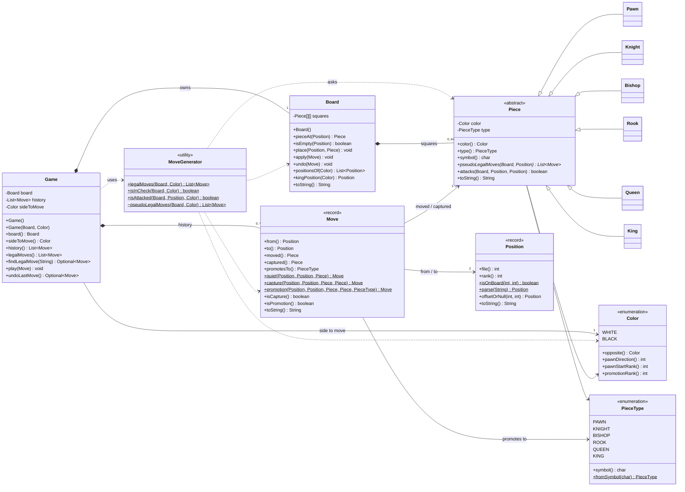
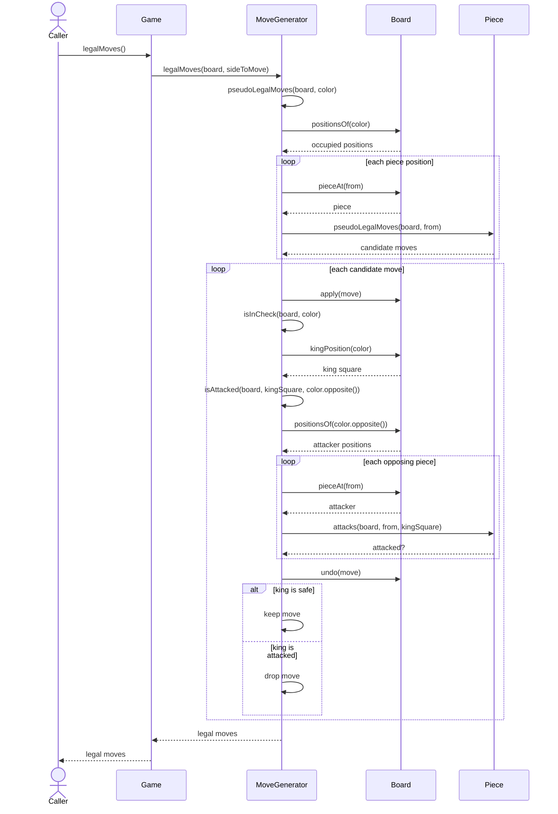

# Chess Engine Design

## Class diagram

```mermaid
classDiagram
    direction LR

    class Game {
        -Board board
        -List~Move~ history
        -Color sideToMove
        +Game()
        +Game(Board, Color)
        +board() Board
        +sideToMove() Color
        +history() List~Move~
        +legalMoves() List~Move~
        +findLegalMove(String) Optional~Move~
        +play(Move) void
        +undoLastMove() Optional~Move~
    }

    class MoveGenerator {
        <<utility>>
        +legalMoves(Board, Color) List~Move~$
        +isInCheck(Board, Color) boolean$
        +isAttacked(Board, Position, Color) boolean$
        ~pseudoLegalMoves(Board, Color) List~Move~$
    }

    class Board {
        -Piece[][] squares
        +Board()
        +pieceAt(Position) Piece
        +isEmpty(Position) boolean
        +place(Position, Piece) void
        +apply(Move) void
        +undo(Move) void
        +positionsOf(Color) List~Position~
        +kingPosition(Color) Position
        +toString() String
    }

    class Piece {
        <<abstract>>
        -Color color
        -PieceType type
        +color() Color
        +type() PieceType
        +symbol() char
        +pseudoLegalMoves(Board, Position)* List~Move~
        +attacks(Board, Position, Position) boolean
        +toString() String
    }

    class Pawn
    class Knight
    class Bishop
    class Rook
    class Queen
    class King

    class Move {
        <<record>>
        +from() Position
        +to() Position
        +moved() Piece
        +captured() Piece
        +promotesTo() PieceType
        +quiet(Position, Position, Piece) Move$
        +capture(Position, Position, Piece, Piece) Move$
        +promotion(Position, Position, Piece, Piece, PieceType) Move$
        +isCapture() boolean
        +isPromotion() boolean
        +toString() String
    }

    class Position {
        <<record>>
        +file() int
        +rank() int
        +isOnBoard(int, int) boolean$
        +parse(String) Position$
        +offsetOrNull(int, int) Position
        +toString() String
    }

    class Color {
        <<enumeration>>
        WHITE
        BLACK
        +opposite() Color
        +pawnDirection() int
        +pawnStartRank() int
        +promotionRank() int
    }

    class PieceType {
        <<enumeration>>
        PAWN
        KNIGHT
        BISHOP
        ROOK
        QUEEN
        KING
        +symbol() char
        +fromSymbol(char) PieceType$
    }

    Piece <|-- Pawn
    Piece <|-- Knight
    Piece <|-- Bishop
    Piece <|-- Rook
    Piece <|-- Queen
    Piece <|-- King

    Game *-- "1" Board : owns
    Game *-- "0..*" Move : history
    Game --> "1" Color : side to move
    Game ..> MoveGenerator : uses

    MoveGenerator ..> Board
    MoveGenerator ..> Color
    MoveGenerator ..> Move
    MoveGenerator ..> Piece : asks

    Board *-- "0..64" Piece : squares
    Piece --> Color
    Piece --> PieceType
    Move --> "2" Position : from / to
    Move --> "1..2" Piece : moved / captured
    Move --> PieceType : promotes to
```

## `game.legalMoves()` sequence

```mermaid
sequenceDiagram
    actor Caller
    participant Game
    participant MoveGenerator
    participant Board
    participant Piece

    Caller->>Game: legalMoves()
    Game->>MoveGenerator: legalMoves(board, sideToMove)
    MoveGenerator->>MoveGenerator: pseudoLegalMoves(board, color)
    MoveGenerator->>Board: positionsOf(color)
    Board-->>MoveGenerator: occupied positions

    loop each piece position
        MoveGenerator->>Board: pieceAt(from)
        Board-->>MoveGenerator: piece
        MoveGenerator->>Piece: pseudoLegalMoves(board, from)
        Piece-->>MoveGenerator: candidate moves
    end

    loop each candidate move
        MoveGenerator->>Board: apply(move)
        MoveGenerator->>MoveGenerator: isInCheck(board, color)
        MoveGenerator->>Board: kingPosition(color)
        Board-->>MoveGenerator: king square
        MoveGenerator->>MoveGenerator: isAttacked(board, kingSquare, color.opposite())
        MoveGenerator->>Board: positionsOf(color.opposite())
        Board-->>MoveGenerator: attacker positions
        loop each opposing piece
            MoveGenerator->>Board: pieceAt(from)
            Board-->>MoveGenerator: attacker
            MoveGenerator->>Piece: attacks(board, from, kingSquare)
            Piece-->>MoveGenerator: attacked?
        end
        MoveGenerator->>Board: undo(move)
        alt king is safe
            MoveGenerator->>MoveGenerator: keep move
        else king is attacked
            MoveGenerator->>MoveGenerator: drop move
        end
    end

    MoveGenerator-->>Game: legal moves
    Game-->>Caller: legal moves
```
